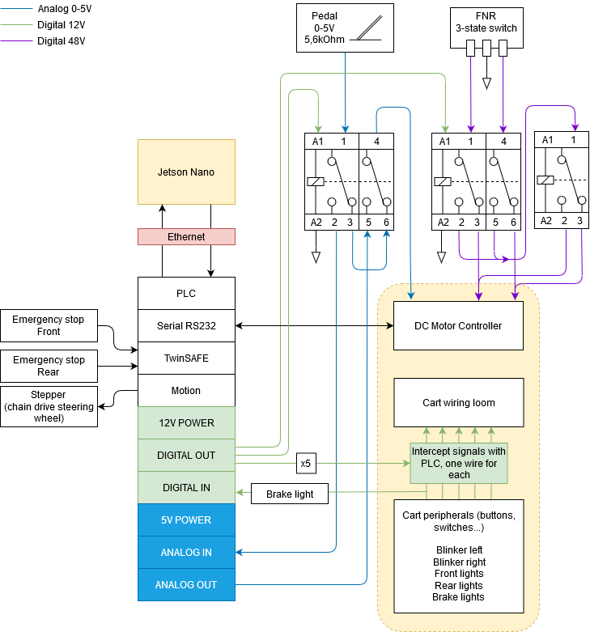

# Automotive-PLC

## algemene info
De bedoeling met dit project is om een kart te maken die autonoom mensen van hun parkeerplaats naar hun werkplaats te brengen op onze campus.

Deze repository bevat het plc gedeelte van een gezamelijk project om een golfkart autonoom te laten rijden, de andere delen kun je hier vinden.
  - Automotive2 : https://github.com/KingAbad/Autonomous_Cart_2
  - Automotive-PLC: https://github.com/yomaxx/Automotive-PLC
 
Hierboven kun je alle documentatie terugvinden om dit project zelf te maken, een overzicht van de directories staat hieronder.
 
 ## source roadmap
 ```
 Documentatie clubcart		directory met documentatie over de cart
 Documentatie project		directory met documentatie over het project
 PLCAutomotive			directory met twincat programma
 ```

### Motion
In het motion gedeelte wordt een stepper motor aangestuurd voor het stuur, de opstelling hiervan is terug te vinden in de documentatie.
Bij PLC kun je een visualisatie terugvinden om de werking te bekijken.

### Twinsafe
Voordat de kart kan bewegen moet de safety gereset worden. Hier hebben we een gewone drukknop op een normale ingang voor genomen. De safety zal de kart vrijgeven op een negatieve flank.
Als je bij SAFETY gaat kijken vindt je de functies voor de noodknoppen. Wij hebben gekozen om 2 dubbele NC contact noodstoppen te voorzien. De twinsafe input stuurt elke paar ms omstebeurt bij elk contact een kleine puls en verwacht deze terug. als hij deze niet ziet zet hij de kart meteen stop. De twee contacten van elke noodstop zijn ook samen gegroepeerd zodat als er ergens een kabelbreuk is en maar 1 contact wegvalt  hij nogsteeds stopt en je kunt zien bij welke noodstop het probleem zich voordoet.

### TwinCAT_TCP_IP_Server

A function block for receiving and sending data using TF6310 TwinCAT TCP/IP Server.

- Usage

		-Video guide: https://www.youtube.com/watch?v=ATKTYQo91UY
		-Install TwinCAT
		-Install Python3.
		-Run the TwinCAT program in PLCAutomotive.
		-If using anything else than localhost on Microsoft Windows,
			add TCP port 24100 as exclusion in firewall (inbound and outbound)
			https://answers.microsoft.com/en-us/windows/forum/all/adding-windows-firewall-exceptions/6e4578ae-420d-46a6-8bbc-3182b31e6ebd
		
		-Run tcp_client.py using python3

See commands.md for the available commands. TwinCAT will echo back all commands.

- How it works
What's happening inside the function block FB_TcpServer:

The function block FB_SocketConnect will open the socket at the specific port (in our example port:24100).
Python client will then need to connect to the host and the port.
Every half a second, FB_SocketAccept will accept any incoming connection, and populate the variable 'hSocket' with the local address of the server and remote address of the client.
The server program also expects a command from the client every 200ms, if no command is received in 200ms it is considered as disconnected.

The function block FB_SocketSend and FB_SocketReceive use this 'hSocket' variable to send and receive data.



## Built with
* *Twincat 3*
* *Python 3*

## Authors

* *Dieter Vanrykel* - lector
* *Max Valkenburg* - student
* *Sam Knoors* - student
* *Oguzhan Erdem* - Student
* *Berkan Ipek* - Student


